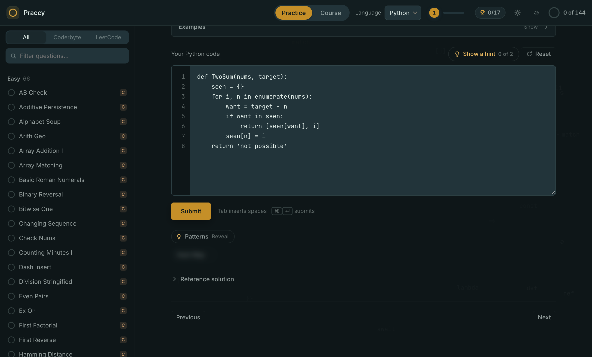
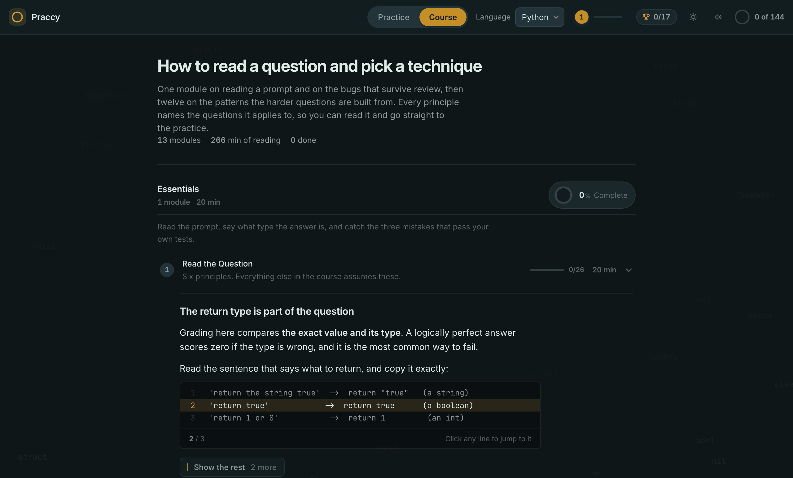
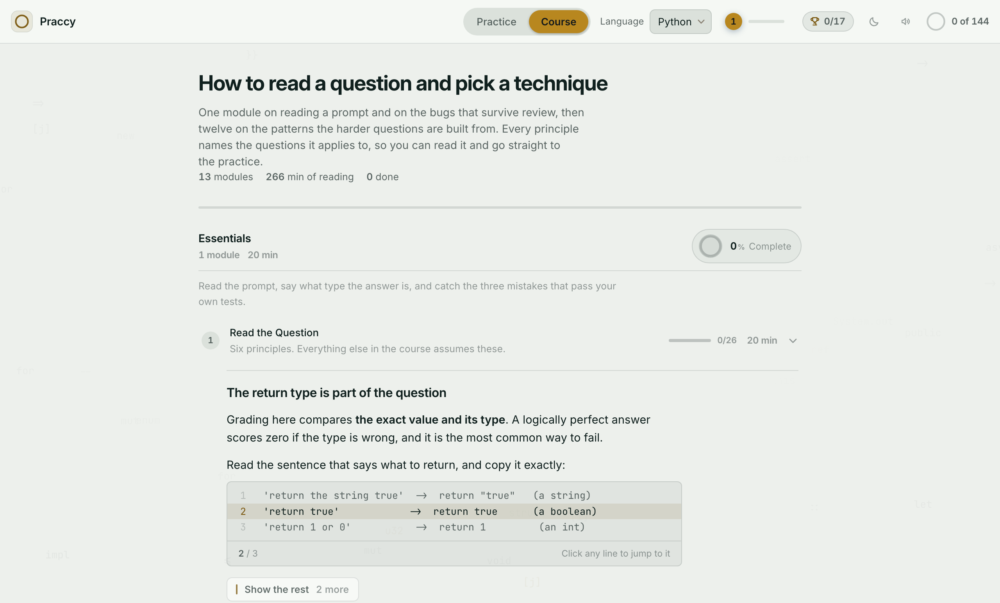
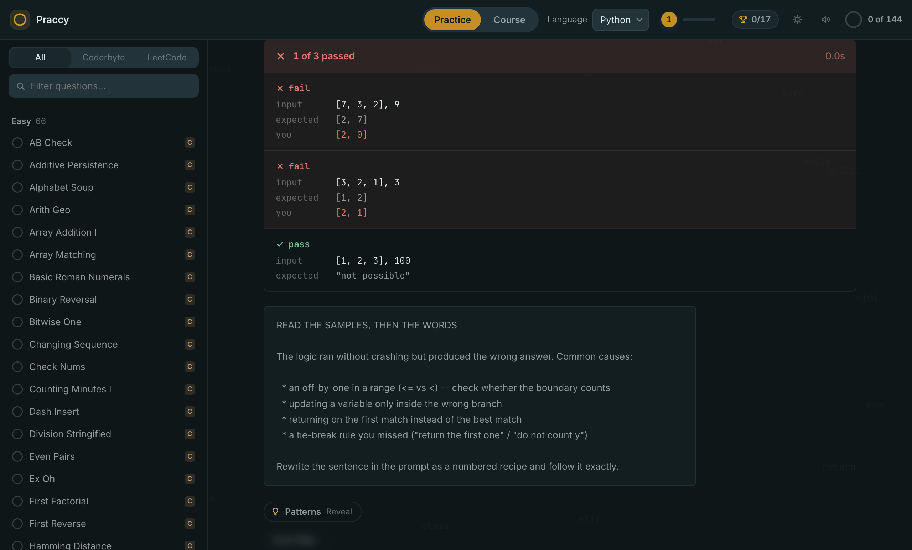

# Praccy

**Learn to recognise the technique a question is asking for.**

Then practise it against a stopwatch and a grader that does not let you off.

---

## The thing that is hard to learn

Almost nobody is bad at interview questions because they cannot code. They are
bad at the step before coding: working out, from the shape of the answer, which
technique the question is reaching for.

That step is skipped by nearly all practice, and it is skipped quietly. The
question arrives already solved in your head, so the only thing being drilled is
transcription. You feel like you are getting better. What you have actually got
better at is typing, and the interview has not changed.

Praccy is built around putting that step back in front of you.

## Learn

Thirteen modules, about four and a half hours. Read them once; they are not
reference material.

**Essentials** is one short module, and it is the part most people skip: how to
read a question, how to name what type the answer is, and the three bugs that
survive your own review. Everything after it assumes this.

**Patterns** is the other twelve, and it is where the time goes — the techniques
the harder questions are actually built from. Two pointers, sliding windows, hash
maps and sets, stacks, linked lists, trees, graphs, backtracking, dynamic
programming, heaps and greedy choices, and how to search a sorted sequence
without ever scanning it twice.

Each principle is a claim about when a technique applies, the argument for why
it works there, the specific mistake people make inside it, and one question to
ask yourself before you move on. That last part is the sentence worth carrying
into the room, so it is set apart from the prose rather than buried in it.

Two things make it read rather than scroll. A principle arrives one beat at a
time — the claim, then the rest of the argument on request — so the choice you
face is "keep going" rather than "read all of this or none of it". And where
there is code, the whole block stays on screen with one line picked out of it,
because recognising the shape of the finished code is the skill, and reading it
top to bottom only teaches you the syntax.

Every principle names the questions it applies to, and each section shows a ring
filled in by how many of those you have actually solved.

Light appearance

## Practise

144 questions: 72 shaped like Coderbyte, 72 real LeetCode problems, 66 of them
the Grind 75. Easy through hard, filterable, and all of them with reference
solutions in five languages.

The practice is built to make the thing you just learned the thing you actually
do.

**The grader runs your code.** Not a diff, not an approximation — your solution is
compiled or interpreted and run against every test case, by the same toolchains
an interviewer would use.

**It is strict about the output type.** Returning a list where a string was
expected scores zero, the way the real Coderbyte site scores it. A large share of
real interview failures are exactly this: right answer, wrong shape.

**It tells you what went wrong, not that something did.** Below, a solution that
finds the right pair and returns it in the wrong order. One case of three
passes. The panel names the case, prints what it expected, prints what you
returned, and then names the mistakes that produce precisely this failure.

**The clock measures the question, not the attempt.** A wrong answer does not
stop it, because in the room there is no pause. It resets when you pass.

**Hints cost you nothing but admitting you are stuck.** Two per question. The
reference solution exists, but only behind a click.

## Running it

A local app. Nothing is uploaded, nothing is phoned home, and it works with the
network switched off.

| | | |
|---|---|---|
| **macOS** | `Praccy-macOS.zip` | Unpacks to `Praccy.app`. Not notarised, so first launch needs right-click then Open. |
| **Windows** | `Praccy.exe` | Windows 10 and 11 already contain the WebView2 runtime it needs. |
| **Linux** | `Praccy.AppImage` | `chmod +x`, then run. Needs a recent `webkit2gtk`. |

From a clone, `python3 praccy.py` — no build step.

Python ships with the app and is the only language guaranteed to work on a fresh
machine. C++, C#, Java and Rust need a compiler you may or may not have; the app
checks on first run and tells you what to install.

## How it is built

A local HTTP server, a browser view, and a Python engine that shells out to the
real toolchains — `clang++`, `rustc`, `javac`, `dotnet` — because a grader that
does not actually run your code is not a grader.

`cbp/` is the whole application: engine, adapters, server, interface, standard
library only. `praccy.py` is the shell, one file opening a native webview on all
three operating systems. Both typefaces are bundled, so the interface looks the
same on a machine that has never heard of any of them.

The grading rules, the strictness rules, the packaging, and a number of things
that turned out to be harder than they looked are in
**[DEVELOPING.md](DEVELOPING.md)**.

## Licence

Private repository. All rights reserved.
